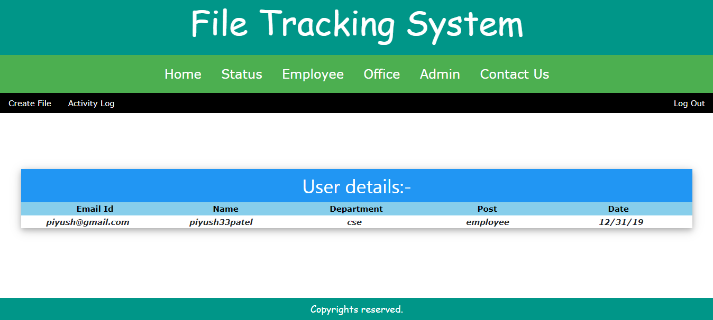
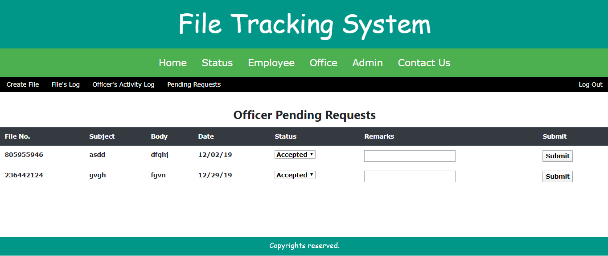

# File Tracking System  

This system is based on the MVC or Model-View-Controller methodology for organizing web server code. 
1. Model component is database sqlite3 for organizing data in efficient way.
2. Controller is developed through Flask, a framework written in Python.
3. View, the aesthetics of application is developed through HTML and CSS.
So,Let's take a look at it. 
**Home Page**

**File Status Checking Page**

**Login Page of Employee**

**View of all the users are same**

**Facility to create file**

**On submit unique file no. generated**

**Employee's submitted files status**

**Login Page of Officer**

Officer can submit his request through CREATE FILE and check status through FILE LOG 
**Requests transferred to officer**

**Officer's Reports**

**Login Page for Admin**

**Admin's Reports**

**Requests transferred to admin from officer**

**New users can be registered through admin**

My model has two entities File and User and a relationship between them as Fileuser 
If you like it give this a star 